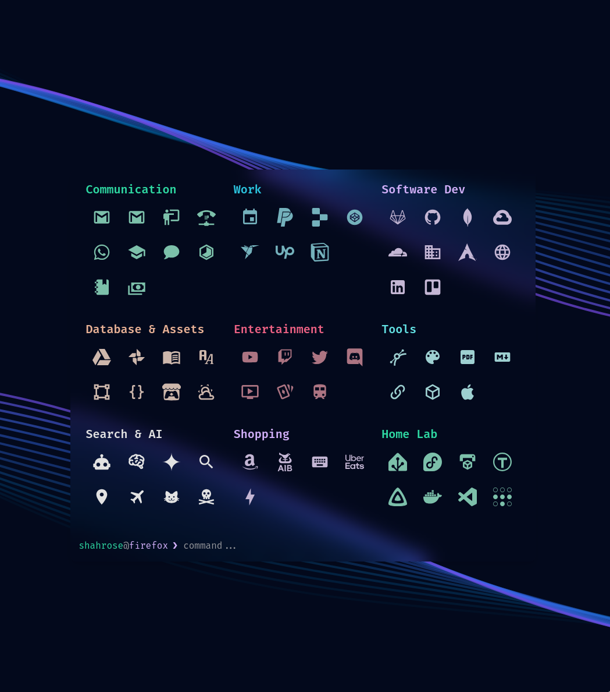

	<h1 align="center">Rose's Excalith Fork</h1>
	

## RoseMaster's Fork

This is a fork of [Excalith Start Page](https://github.com/excalith/excalith-start-page). The following changes have been made:
* Config Preferences (DuckDuckGo, animated SVG background, etc)
* Flexible Search (sub-string search for more matching)
* Removed Link Text-Labels (I now use name field as a place to list "tags" which works better with my Flexible Search feature)
* Changed Lists (renders as a grid of large icons)
* Removed `setting.json` Caching (I like to edit the `settings.json` by remoting into my server directly, I prefer my text editor over the built in `config edit` tool)
* Aggressive Link Execution (when you press Enter, Excalith will redirect you to the first matching link based on what you have typed. Only if 0 matches are found will it fall back to a search engine.)

## Deployment
I'm a firm believer in self-hosting. I've seen many popular "free" hosting platforms come and go when the VC money ineveitably runs dry. Here is my strategy:

0. Install Yarn `curl -o- -L https://yarnpkg.com/install.sh | bash`
0. Install PM2 `npm install -g pm2`

1. Clone App `git clone git@github.com:RoseMaster3000/excalith-start-page.git`
2. Build App `yarn install; yarn build`
3. Deploy PM2 `PORT=3001 pm2 start yarn --name "excalith" -- start`
4. Verify PM2 `pm2 list; pm2 save; pm2 startup;`
5. Reverse Proxy with Caddy and [basic_auth](https://caddyserver.com/docs/caddyfile/directives/basic_auth)

## License

The code is available under the [MIT license](LICENSE). Feel free to copy, modify, and distribute the code as you wish, but please keep the original license in the files. Attribution is appreciated and will definitely help improving this project.
